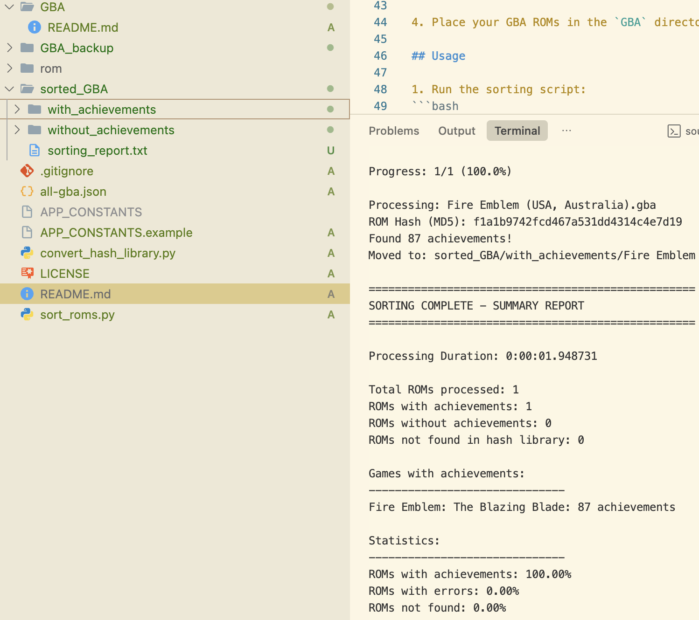

# HasCheevos - GBA ROM Achievement Sorter

A Python utility to sort Game Boy Advance (GBA) ROMs based on whether they have achievements on RetroAchievements.org.



## Features

- Automatically sorts GBA ROMs into two categories:
  - ROMs with achievements
  - ROMs without achievements
- Generates detailed sorting reports including:
  - Number of achievements per game
  - Processing statistics
  - Error logs
- Uses RetroAchievements API to fetch game information
- Maintains a local hash library for efficient ROM identification

## Prerequisites

- Python 3.x
- RetroAchievements.org account
- RetroAchievements API key

## Setup

1. Clone this repository:
```bash
git clone git@github.com:zhadtech/checkRetroAchievement.git
cd checkRetroAchievement
```

2. Install required Python packages:
```bash
pip install requests
```

3. Set up your credentials:
   - Copy `APP_CONSTANTS.example` to `APP_CONSTANTS`
   - Edit `APP_CONSTANTS` with your RetroAchievements username and API key:
   ```
   RA_USERNAME=your_username_here
   RA_API_KEY=your_api_key_here
   ```

4. Place your GBA ROMs in the `GBA` directory

## Usage

1. Run the sorting script:
```bash
python sort_roms.py
```

2. The script will:
   - Process all GBA ROMs in the `GBA` directory
   - Sort them into `sorted_GBA/with_achievements` and `sorted_GBA/without_achievements`
   - Generate a detailed report in `sorted_GBA/sorting_report.txt`

## Directory Structure

```
checkRetroAchievement/
├── GBA/                    # Place your ROMs here
├── data/
│   └── 0_hashlibrary.json # ROM hash library
├── sorted_GBA/
│   ├── with_achievements/    # ROMs with achievements
│   ├── without_achievements/ # ROMs without achievements
│   └── sorting_report.txt   # Detailed sorting report
├── app_constants           # Your API credentials (not tracked in git)
├── app_constants.template  # Template for API credentials
├── sort_roms.py           # Main sorting script
└── README.md              # This file
```

## Notes

- The script includes a 1-second delay between API calls to respect rate limits
- Make sure to keep your API credentials private and never commit them to git
- The hash library helps reduce API calls and improve sorting speed

## Update Hash library
Use this endpoint to get all the hash for a single system (example: GBA) and save it to `all_hash/all-gba.json`

```bash
curl --location 'https://retroachievements.org/API/API_GetGameList.php?i=5&h=1&f=1&y=[YOUR_API_KEY]&f=1'
```

Run the following command to update the hash data  

```bash
python convert_hash_library.py 
```

## Update `all_hash/` for all systems (auto)

This repo includes a helper script to upsert (create/overwrite) `all_hash/all-*.json` for every system in `data/all_system_id.json`, with a ~1 second delay between API calls.

```bash
python update_all_hash.py
```

If you don’t want to store your API key in `APP_CONSTANTS`, you can also pass it directly:

```bash
python update_all_hash.py --api-key "[YOUR_API_KEY]"
```

## Troubleshooting

If you encounter errors:
1. Check that all required files exist
2. Verify your RetroAchievements credentials
3. Ensure the hash library is up to date
4. Check the sorting report for specific error messages 

## Note From Author

This repo only support to check achievement for GBA rom at the moment.
Feel free to open issues or submit pull requests for any improvements.
